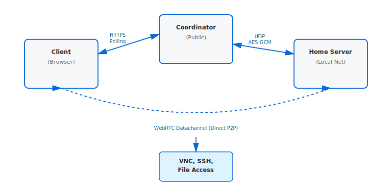

# HomeChannel

A minimal-dependency WebRTC datachannel solution for secure remote access to home systems (VNC, SSH, file access).

## Overview

HomeChannel enables direct peer-to-peer connections between browser clients and home servers through a lightweight coordinator. Built with pure JavaScript, zero bundling, and minimal dependencies.

### Key Features

- **Zero Build Tooling**: Pure JavaScript (ES modules), no transpilation or bundling
- **Minimal Dependencies**: Uses only Node.js built-in modules
- **Direct P2P**: WebRTC datachannel between client and server
- **Secure**: ECDSA signatures, AES-GCM authenticated encryption, challenge-response authentication
- **Lightweight**: Memory-compact design, optimized protocol
- **NAT-Friendly**: Efficient keepalive and NAT traversal
- **Coordinator Migration**: Support for seamless coordinator failover and migration

## Architecture



**Three Components:**

1. **Client** (Browser): Initiates connections via HTTPS polling to coordinator
2. **Coordinator** (Public Node.js): Facilitates signaling, verifies challenges
3. **Server** (Home Node.js): Provides access to local services via WebRTC

## Quick Start

### Prerequisites

- Node.js 18+
- Modern browser with WebRTC support
- One of the WebRTC libraries for server (see [WebRTC Libraries](docs/WEBRTC_LIBRARIES.md)):
  - `werift` (recommended) - Pure JavaScript, no compilation
  - `wrtc` - Native bindings to libwebrtc
  - `node-datachannel` - Lightweight C++ bindings

**Note on WebRTC Libraries:** The server lists all three libraries as `optionalDependencies` in package.json. Running `npm install` will attempt to install all of them, but some may fail (especially `wrtc` which requires native compilation). This is expected - you only need one working library. The server will automatically detect and use available libraries.

### Installation

```bash
# Clone repository
git clone https://github.com/denisps/homechannel.git
cd homechannel

# Set up coordinator (on public server)
cd coordinator
# Edit config.json with your settings
npm test  # Verify installation
node index.js

# Set up server (on home network)
cd ../server
# Install dependencies (includes all optional WebRTC libraries)
npm install
# Note: Some WebRTC libraries may fail (e.g., wrtc with native compilation)
# but you only need one working library

# Copy and edit config.example.json to config.json
npm test  # Verify installation
node index.js

# Access client
# Open client/apps/filebrowser.html in your browser
```

### Example Usage

**1. Start Coordinator (Public Server)**
```bash
cd coordinator
node index.js
# Coordinator listens on UDP port 3478 and HTTPS port 8443
```

**2. Start Server (Home Network)**
```bash
cd server
# Edit config.json with your coordinator URL and password
node index.js
# Server registers with coordinator and waits for connections
```

**3. Connect with File Browser (Browser)**
- Open `client/apps/filebrowser.html` in your browser
- Enter coordinator URL: `https://your-coordinator:8443`
- Enter server public key (shown in server logs)
- Enter password (same as in server config)
- Click "Connect"
- Browse, upload, download files on your home network

## Security Model

- **ECDSA P-256**: Initial handshake and signature verification
- **AES-GCM Encryption**: All server-coordinator UDP messages (after ECDH)
- **Challenge-Response**: Prevents brute-force and DDoS attacks
- **Authenticated Encryption**: AES-GCM provides both confidentiality and integrity
- **Direct Datachannel**: Coordinator cannot intercept peer data

## Protocol

### Server ↔ Coordinator (UDP)
- **Registration**: ECDSA-signed, encrypted with ECDH shared secret
- **Keepalive**: Optimized ping (no payload, no encryption), every 30s
- **Challenge Refresh**: AES-GCM encrypted heartbeat, every 10 minutes

### Client ↔ Coordinator (HTTPS)
- Standard polling (no WebSockets)
- Challenge verification before connection
- Signed SDP and ICE candidates relay

See [PROTOCOL.md](docs/PROTOCOL.md) for detailed specifications.

## Documentation

### Architecture & Protocol
- [ARCHITECTURE.md](docs/ARCHITECTURE.md) - System design and components
- [PROTOCOL.md](docs/PROTOCOL.md) - Detailed protocol specifications
- [SECURITY.md](docs/SECURITY.md) - Security architecture and cryptography
- [WEBRTC_LIBRARIES.md](docs/WEBRTC_LIBRARIES.md) - WebRTC library options for Node.js

### Component Documentation
- [coordinator/README.md](coordinator/README.md) - Coordinator implementation
- [server/FILE_SERVICE.md](server/FILE_SERVICE.md) - File service API
- [client/README.md](client/README.md) - Client API reference
- [client/apps/README.md](client/apps/README.md) - File Browser app guide

### Code Reference
- [shared/crypto.js](shared/crypto.js) - Crypto primitives (ECDSA, ECDH, AES-GCM)
- [shared/protocol.js](shared/protocol.js) - Protocol constants and UDP helpers
- [.github/copilot-instructions.md](.github/copilot-instructions.md) - Development guidelines

## Development

```bash
# Install optional test dependencies (WebRTC libraries, etc.) without saving
npm run test:deps

# Run ALL tests from root (npm workspaces)
npm test                    # All workspace tests
npm run test:shared         # Shared module tests only
npm run test:client         # Client tests only
npm run test:server         # Server tests only
npm run test:coordinator    # Coordinator tests only
npm run test:tests          # All integration/E2E/system tests
npm run test:integration    # Integration tests only
npm run test:e2e            # E2E tests only
npm run test:system         # System tests only
npm run test:all            # ALL tests including test suites in tests/

# Or run tests per directory:

# Run shared crypto/protocol tests
cd shared
npm test

# Run coordinator tests
cd ../coordinator
npm test

# Run server tests
cd ../server
npm test

# Run server WebRTC connectivity tests (optional, requires WebRTC library)
npm run test:webrtc

# Run ALL server tests including connectivity
npm run test:all

# Run client tests
cd ../client
npm test

# Run E2E and system tests
cd ../tests
npm test                    # All tests
npm run test:integration   # Integration tests only
npm run test:e2e           # E2E tests only
npm run test:system        # System tests only
```

**Test Documentation:**
- [docs/TESTING.md](docs/TESTING.md) - Comprehensive testing guide

**Test Coverage:**
- **132 tests** across all components (100% passing)
- Unit tests for all core functionality
- Integration tests with real protocol implementations
- **E2E tests** for full system validation
- **System tests** for concurrency and scalability

**Technology Constraints:**
- Pure JavaScript (no TypeScript)
- ES modules for client, CommonJS/ES modules for Node.js
- No build tooling or bundling
- Minimal dependencies only

## Project Status

**Alpha**: API and protocol are subject to change.

## Roadmap

- [x] Coordinator implementation with tests
- [x] AES-GCM authenticated encryption for UDP communication
- [x] Server implementation with WebRTC support
- [x] Client API (browser ES modules)
- [x] HTTPS endpoints for client-coordinator communication
- [x] File service API for remote file access
- [x] File Browser web application
- [x] Comprehensive test coverage
- [x] Documentation and examples
- [ ] Additional service types (VNC, SSH)
- [ ] Performance optimizations
- [ ] Multi-coordinator redundancy

## Contributing

Contributions welcome! Please read [.github/copilot-instructions.md](.github/copilot-instructions.md) for development guidelines.

## License

GPL-3.0 - See [LICENSE](LICENSE) for details.

## Credits

Designed for minimal resource usage and maximum simplicity.
