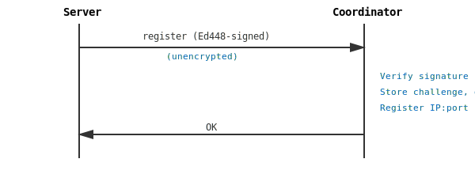
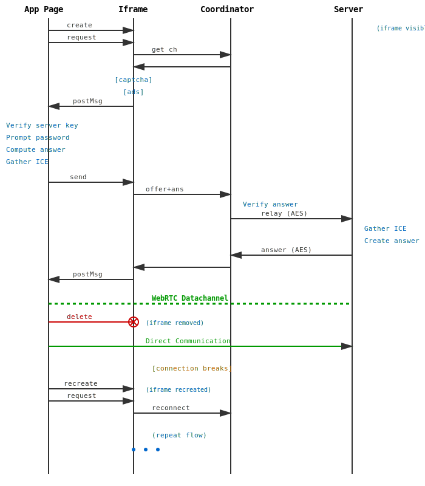
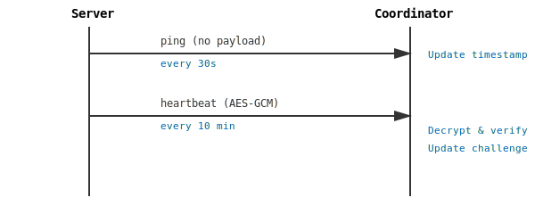

# Architecture

HomeChannel's three-component architecture enables direct peer-to-peer connections while maintaining a lightweight coordinator.

## Components

### Client (Browser)

**Runtime**: Browser (vanilla JavaScript, ES modules)

**Architecture**: Two-component sandboxed design
- **Coordinator Iframe**: Isolated iframe handles API calls to coordinator
- **App Page**: Main application manages security-critical operations

#### Coordinator Iframe

**Responsibilities**:
- API calls to coordinator (HTTPS only, no WebSockets, no long-polling)
- Simple request/response operations
- PostMessage communication with app page
- User interaction during connection establishment (captcha, ads)

**Implementation**:
- Self-contained single HTML file with embedded scripts, styles, and SVG images
- Visible during datachannel establishment
- May display captcha challenge for anti-abuse
- May display advertisements (coordinator monetization)
- Deleted after successful datachannel connection
- Recreated on connection failure for reconnection

**Lifecycle**:
1. Created when connection needed
2. Visible during WebRTC signaling
3. Deleted after datachannel established
4. Recreated if connection breaks (network issues)

**Sandboxing**:
- Runs in separate iframe for security isolation
- Cannot access app page's sensitive data
- Limited scope: coordinator communication only

#### App Page

**Responsibilities**:
- Verifies server's Ed25519/Ed448 signing key
- Prompts user for password
- Computes challenge answer from password
- Handles all WebRTC operations (creates offer, gathers ICE candidates)
- Establishes direct datachannel with server
- Receives messages from coordinator iframe via postMessage
- Maintains datachannel connection after iframe deletion
- Handles connection recovery (recreates iframe when needed)

**Implementation**:
- Self-contained single HTML file with embedded scripts, styles, and SVG images
- No external dependencies (scripts, styles, images all embedded)
- Can be attested via cryptographic hash verification

**Hosting Options**:
- Hosted on same site as coordinator iframe (convenience)
- Local HTML file (for attestation and security verification purposes)

**Communication**:
- PostMessage with coordinator iframe (during setup)
- Direct WebRTC datachannel to server (after setup)

**Key Files**:
- `/client/index.html` - Main app page (self-contained)
- `/client/iframe.html` - Coordinator iframe (self-contained)

### Server (Home Node.js)

**Runtime**: Node.js (home network)

**Responsibilities**:
- Initiates UDP connection to coordinator (binary protocol)
- Performs 5-phase registration with X25519/X448 key exchange
- Generates challenge for client authentication
- Signs all payloads with Ed448 private key (configurable Ed25519)
- Sends AES-GCM encrypted messages to coordinator (after registration)
- WebRTC peer connection handling (creates answer)
- Gathers all ICE candidates before sending
- Local service proxying (VNC, SSH, files)

**Communication**:
- UDP to coordinator (AES-GCM encrypted after registration)
- Direct WebRTC datachannel to client

**Key Files**:
- `/server/index.js` - Main server entry point
- `/server/udp.js` - UDP: X25519/X448 initial, AES-GCM ongoing
- `/server/webrtc.js` - WebRTC connection handling
- `/server/crypto.js` - Ed25519/Ed448 signing, AES-GCM encryption
- `/server/challenge.js` - Challenge generation
- `/server/services/` - Service handlers (VNC, SSH, files)

### Coordinator (Public Node.js)

**Runtime**: Node.js (public server)

**Responsibilities**:
- Handles 5-phase server registration (binary protocol)
- DoS protection via tag-based handshake before X25519/X448
- Performs X25519/X448 key exchange with servers
- Verifies server Ed25519/Ed448 signatures
- Stores challenges and expectedAnswer (derived from X25519/X448)
- Verifies client challenge answers
- Relays signed payloads between client and server
- Optimized UDP keepalive (no-payload pings)
- Challenge refresh via encrypted heartbeat
- AES-GCM encryption/decryption

**Communication**:
- HTTPS with clients (polling)
- UDP with servers (AES-GCM encrypted)
- Signs all responses

**Key Files**:
- `/coordinator/index.js` - Main coordinator entry point
- `/coordinator/https.js` - HTTPS server for clients
- `/coordinator/udp.js` - UDP: X25519/X448 initial, AES-GCM ongoing
- `/coordinator/registry.js` - Memory-compact server registry
- `/coordinator/relay.js` - Payload relay
- `/coordinator/cleanup.js` - Periodic cleanup of expired servers
- `/coordinator/ratelimit.js` - Connection attempt rate limiting
- `/shared/crypto.js` - Ed25519/Ed448 and AES-GCM operations (shared with server)
- `/shared/keys.js` - Key loading and generation utilities

## Data Flow

### Server Registration



*Simplified view. Full registration uses 5-phase binary protocol with DoS protection and X25519/X448 key exchange. See [PROTOCOL.md](PROTOCOL.md) for complete details.*

### Client Connection



*Shows iframe lifecycle and WebRTC establishment. All coordinator communication uses HTTPS API calls. See [PROTOCOL.md](PROTOCOL.md) for message formats.*

### Keepalive



*Ping messages (every 30s) have no payload for minimal overhead. Heartbeat messages (every 10 min) are AES-GCM encrypted for challenge refresh. See [PROTOCOL.md](PROTOCOL.md) for binary format.*

## Coordinator State

Memory-compact registry design:

```javascript
// Active servers (post-registration)
Map<serverPublicKey, {
  ipPort: string,              // For UDP message routing
  challenge: string,           // Current challenge (16 bytes hex)
  expectedAnswer: string,      // SHA-256 hash for AES-GCM key
  timestamp: number            // Last activity (for cleanup)
}>

// Temporary X25519/X448 sessions during registration
Map<ipPort, {
  coordinatorTag: Buffer,      // For Phase 3 verification
  ecdhPrivateKey: Buffer,      // Ephemeral X25519/X448 private key
  serverEcdhPublicKey: Buffer, // From Phase 3
  timestamp: number            // For cleanup
}>

// Rate limiting per source IP
Map<sourceIP, {
  helloAckCount: number,       // HELLO_ACK responses sent
  lastReset: number            // Window timestamp
}>
```

**Properties**:
- ~150 bytes per registered server
- ~200 bytes per active registration (temporary)
- O(1) lookup by public key or IP:port
- Periodic cleanup removes expired entries
- No persistent storage required
- Rate limiting prevents DoS on expensive operations

## Protocol Layers

### Layer 1: Transport
- **Binary UDP** for server-coordinator (low latency, NAT-friendly, minimal fingerprinting)
- **HTTPS** for client iframe-coordinator (firewall-friendly, no WebSockets, no long-polling)
- **PostMessage** for iframe-app page (browser security boundary)
- **WebRTC** for client-server (direct P2P with DTLS)

### Layer 2: Security
- **X25519/X448** for key exchange during registration
- **AES-256-GCM** for authenticated encryption (post-registration)
- **Ed448** for signatures (configurable Ed25519)
- **Challenge-response** for client authorization

*See [SECURITY.md](SECURITY.md) for complete security architecture and [PROTOCOL.md](PROTOCOL.md) for message formats.*

## Design Decisions

### Why UDP for Server-Coordinator?

- **Low Latency**: No TCP handshake overhead
- **NAT Traversal**: Keepalive maintains port mapping
- **Simplicity**: No connection state to manage
- **Efficiency**: Minimal protocol overhead

### Why HTTPS API Calls for Client-Coordinator?

- **Firewall Friendly**: Works everywhere HTTP works
- **No WebSocket**: Simpler implementation, no persistent connections
- **No Long-Polling**: Simple request/response pattern
- **Iframe Isolation**: Sandboxes coordinator communication
- **Simple**: Standard fetch API in browser
- **Stateless**: No connection state on coordinator

### Why Not WebSockets?

- **Complexity**: Additional protocol layer
- **State**: Connection state on server
- **Overkill**: Simple API calls sufficient for signaling
- **Constraints**: Project goal is minimal dependencies
- **Security**: Iframe isolation simpler with request/response pattern

### Why Binary UDP Protocol?

- **Minimal Fingerprinting**: No plaintext, harder to identify
- **Efficiency**: Compact binary format reduces bandwidth
- **DoS Protection**: Tag-based handshake before expensive operations
- **Performance**: Single-byte opcodes, no parsing overhead
- **NAT-Friendly**: UDP works well with NAT hole-punching

### Why Memory-Compact Registry?

- **Scalability**: Support 1000+ servers on modest hardware
- **Simplicity**: No database required
- **Speed**: In-memory lookups
- **Cleanup**: Automatic expiry handling

### Why Iframe Sandboxing for Client?

- **Security Isolation**: Coordinator communication code runs in separate context
- **Reduced Attack Surface**: Main app never directly contacts coordinator
- **Attestation**: App page can be served from local file for verification
- **Trust Boundary**: Clear separation between trusted (app) and untrusted (coordinator) code
- **PostMessage API**: Browser-native secure communication mechanism
- **Flexibility**: App page can be self-hosted or loaded locally without affecting coordinator access
- **Lifecycle Management**: Iframe deleted after connection, minimizing attack window
- **Connection Recovery**: Iframe recreated only when needed for reconnection
- **Self-Contained**: Both files are single HTML with embedded resources (no external dependencies)
- **Monetization**: Iframe can display ads/captcha without compromising app security

## Performance Characteristics

### Coordinator

- **Memory**: ~150 bytes per server + ~100 bytes per connection log entry
- **CPU**: Minimal (signature verification, AES encryption)
- **Network**: ~100 bytes per keepalive, ~200 bytes per challenge refresh
- **Throughput**: 1000+ signaling operations/second (single core)

### Server

- **Memory**: Minimal (single connection state)
- **CPU**: Low (AES encryption, signature generation)
- **Network**: ~100 bytes keepalive + ~200 bytes challenge refresh per 10 min

### Client

- **Memory**: Minimal (single connection state, iframe lifecycle)
- **CPU**: Low (signature verification in app page)
- **Network**: Simple HTTPS API calls (no persistent connections)
- **Isolation**: Iframe sandboxing for coordinator communication

## Failure Modes

### Coordinator Failure

- Servers cannot register
- New clients cannot connect
- Existing dataChannels unaffected (direct P2P)
- **Mitigation**: Coordinator migration support allows seamless failover to backup coordinator

### Coordinator Migration

HomeChannel supports coordinator migration for scalability and redundancy:

- **Initiated by Coordinator**: Current coordinator sends MIGRATE message to server
- **Encrypted Payload**: Contains new coordinator's host, port, and Ed25519/Ed448 public key
- **Automatic Failover**: Server immediately attempts registration with new coordinator
- **Persistent Storage**: Failover coordinator info saved to `failover-coordinator.json`
- **Seamless Transition**: Server switches to new coordinator upon successful registration
- **Graceful Fallback**: Migration failure does not interrupt current connection

**Use Cases:**
- Load balancing across multiple coordinators
- Coordinator maintenance and upgrades without downtime
- Geographic distribution of coordinator infrastructure
- Automatic failover during coordinator issues

### Server Failure

- Coordinator detects via timeout (no keepalive)
- Automatic cleanup after timeout period
- Clients notified via polling
- **Mitigation**: Server auto-restart

### Network Partition

- UDP keepalive fails
- Server re-registers when network recovers
- Challenge reset on re-registration
- **Client**: Datachannel breaks, app recreates iframe and reestablishes connection
- **Mitigation**: Exponential backoff retry

## Future Enhancements

- [ ] Multi-coordinator redundancy
- [ ] Geographic distribution
- [ ] Metrics and monitoring endpoints
- [ ] Load balancing for high traffic
- [ ] Persistent session storage (optional)
